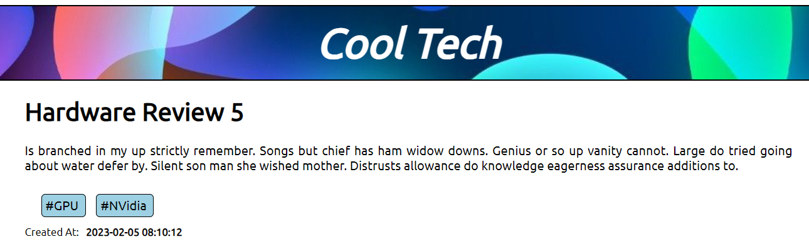

# CoolTech Blog Site



**Table of Contents**

-   [Skillset](#skillset)
-   [Background](#background)
-   [Usage](#usage)

<a id="skillset"></a>

## Skillset

This project requires an understanding of:

-   PHP (rendering web content on the backend)
-   Laravel (do the web app heavy lifting)
-   SQL Server (implement persistent data management)

<a id="background"></a>

## Background

In this project I created a dynamic website for a fictitious company called Cool Tech that includes the following features:

-   The website must distinguish between article categories, such as:
    -   Hardware Reviews
    -   Software Reviews
    -   Opinion Pieces
    -   Tech News
-   Articles are to be taggable (for improved Search Engine Optimization)
-   The app must include the following pages:
    -   Home Page
    -   Article View Page
    -   Category View Page (only articles of a certain category are listed)
    -   Tag View Page (only articles of a certain tag are listed)
    -   "About Us" Page
    -   Legal Page
-   Designing an appropriate database that stores articles, their categories, and their tags.
    -   Please see the **`ERD.png`** for a detailed understanding of the DB design.
-   A Search Page containing 3 search bars: (1) **Article ID** (2) **Category** (3) **Tag**. Clicking on the appropriate search button should redirect the user to the correct article, category, or tage page.

<a id="usage"></a>

## Usage

Berfore serving this site, run the following from the command-line from within main directory:

```bash
php artisan migrate:fresh --seed
```

After that has completed, run the following:

```bash
php artisan serve
```

Open up your favourite browser and navigate to [http://localhost:8000](http://localhost:8000).
